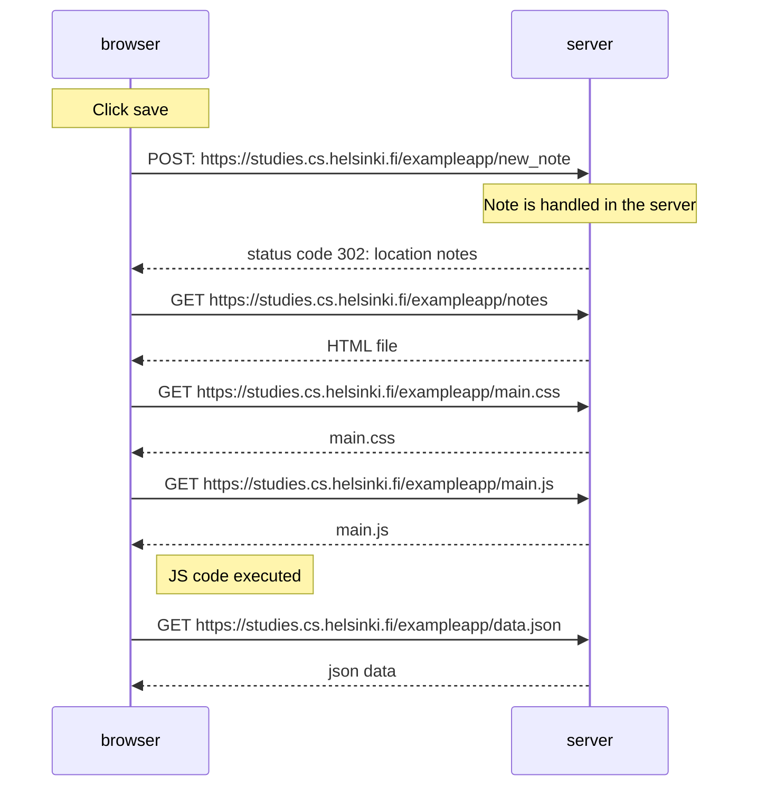

```mermaid
sequenceDiagram
    participant browser
    participant server
    Note over browser: Click save
    browser->>server: POST: https://studies.cs.helsinki.fi/exampleapp/new_note
    Note over server: Note is handled in the server
    server-->>browser: status code 302: location notes
    
    browser->>server: GET https://studies.cs.helsinki.fi/exampleapp/notes
    server-->>browser: HTML file
    
    browser->>server: GET https://studies.cs.helsinki.fi/exampleapp/main.css
    server-->>browser: main.css
    browser->>server: GET https://studies.cs.helsinki.fi/exampleapp/main.js
    server-->>browser: main.js
    Note right of browser: JS code executed
    
    browser->>server: GET https://studies.cs.helsinki.fi/exampleapp/data.json
    server-->>browser: json data
```