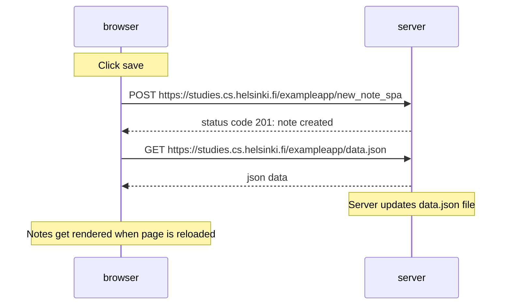

```mermaid
sequenceDiagram
    participant browser
    participant server
    Note over browser: Click save
    browser->>server: POST https://studies.cs.helsinki.fi/exampleapp/new_note_spa
    server-->>browser: status code 201: note created

    browser->>server: GET https://studies.cs.helsinki.fi/exampleapp/data.json
    server-->>browser: json data
    Note over server: Server updates data.json file
    Note over browser: Notes get rendered when page is reloaded
```